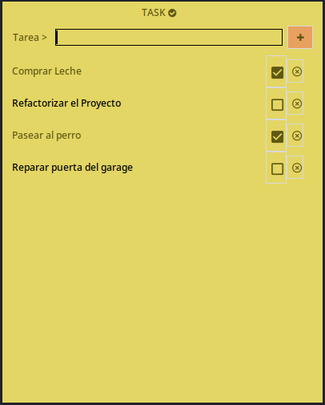

<h1 style="font-size: 3em; color: #e3d664;">Task</h1>

Aplicación de Lista de Tareas, elaborada en lenguaje Python y una interfaz simple en Tkinter.
Proyecto personal para la práctica del lenguaje Python, POO y Tkinter

#### Instalación

Para instalar la calculadora, asegúrate de tener Python 3 instalado en tu sistema. Luego, clona el repositorio y ejecútalo.

#### Cómo usar Task

Las tareas pueden registrarse en el recuadro superior y hacer click en el botón +; la tarea se agregará al listado inferior junto a un botón de checklist ☑️ que ayudará a marcar y desmarcar las tareas completadas, así como también, un botón de X para eliminar las tareas que ya no se necesiten.

#### Contribuciónes al código

Si deseas contribuir a la aplicación, por favor crea un fork del repositorio y envía tus cambios a través de un pull request. Todas las sugerencias y mejoras son bienvenidas 👍

GUScode